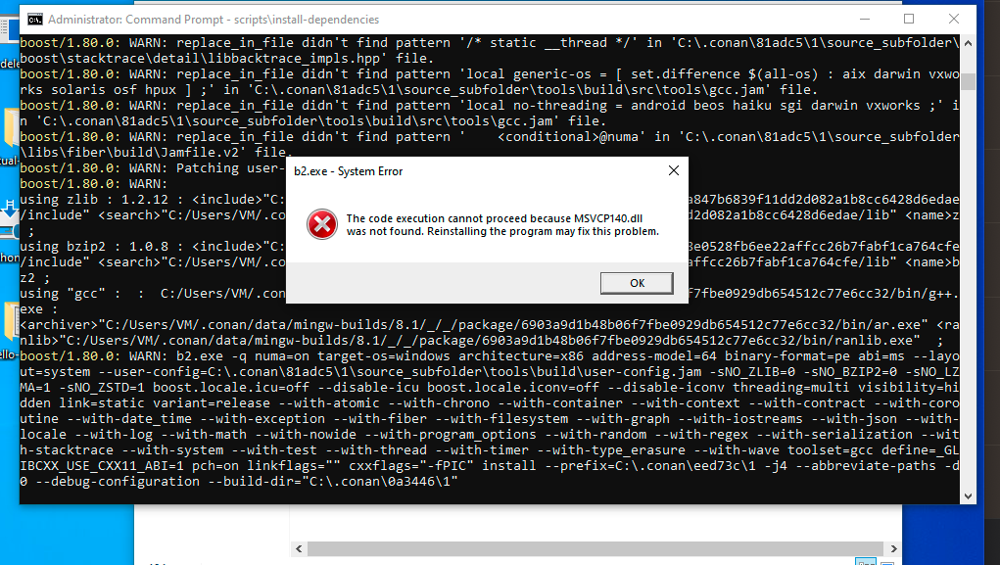

# Boost Log

An example c++ project with boost::log, based on the tutorial [Getting Started Quickly With C++ Logging | Scalyr Blog](https://www.sentinelone.com/blog/getting-started-quickly-cplusplus-logging/).

## build

### Windows

The build suggested in [conan/profiles/cmake-3.24.1-mingw-8.1](conan/profiles/cmake-3.24.1-mingw-8.1) uses:

- cmake 3.24.1
- mingw-builds 8.1
- msys2 20210105

## scripts

See `scripts` folder for build scripts for common actions.

## Known Bugs

### Windows

Conan's Boost/1.80.0 includes build tool binaries that rely on the MSVC++ 2015 redistributables. Because of this, building with mingw-build instead of Visual Studio causes the following error:

A workaround is to install the MSVC redistributables.

See [Latest supported Visual C++ Redistributable downloads | Microsoft Learn](https://learn.microsoft.com/en-us/cpp/windows/latest-supported-vc-redist?view=msvc-170) for the latest installer, which as of `2022 Sept 21` is the MSVC 2017 redistributables, which provides 2015-2019-compatible (backwards *and* forwards?) binaries.
